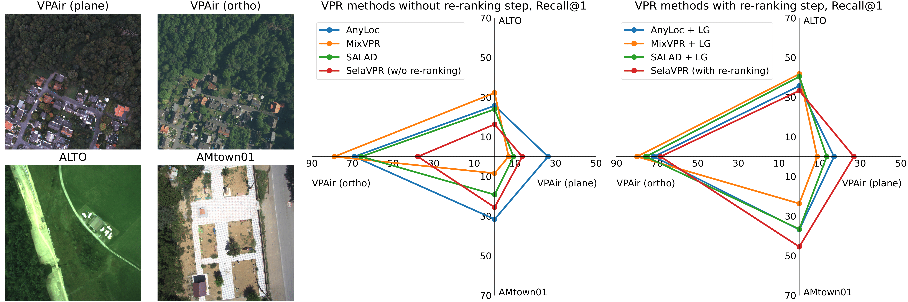

# aero-vloc
[](https://github.com/prime-slam/aero-vloc/actions/workflows/ci.yml)
[](https://github.com/psf/black)

This is the official repository for the paper "Visual place recognition for aerial imagery: A survey".

[arXiv](https://arxiv.org/abs/2406.00885) | [ScienceDirect](https://www.sciencedirect.com/science/article/abs/pii/S0921889024002215)



## Summary
This paper introduces a methodology tailored for evaluating VPR techniques specifically
in the domain of aerial imagery, providing a comprehensive assessment of various methods and their performance. However, we
not only compare various VPR methods, but also demonstrate the importance of selecting appropriate zoom and overlap levels
when constructing map tiles to achieve maximum efficiency of VPR algorithms in the case of aerial imagery.
 
Our benchmark tool supports AnyLoc, CosPlace, EigenPlaces, MixVPR, NetVLAD, SALAD and SelaVPR VPR systems
as well as LightGlue, SelaVPR and SuperGlue re-ranking techniques.

## Getting started
The tool has been tested on Python 3.10 with versions of the libraries from `requirements.txt`. 
We recommend using the same parameters for creating a virtual environment.

Please check `example.ipynb` for an example of downloading the satellite map, localizing of aerial imagery and using the Recall metric.
Weights for MixVPR, NetVLAD, SuperGlue and SelaVPR as well as cluster centers for AnyLoc can be downloaded [here](https://drive.google.com/file/d/1D10Ulavy9VNXZb-0GTCngbheLyfIkrf-/view?usp=sharing).
To use SelaVPR you will also have to download the pre-trained DINOv2 model [here](https://dl.fbaipublicfiles.com/dinov2/dinov2_vitl14/dinov2_vitl14_pretrain.pth).
All other necessary files for CosPlace, EigenPlaces, LightGlue and SALAD will be downloaded automatically via TorchHub.

## Datasets
We used the [VPAir](https://github.com/AerVisLoc/vpair) datasets (from the [Anyloc repo](https://github.com/AnyLoc/AnyLoc?tab=readme-ov-file#included-datasets)) 
as well as [ALTO](https://github.com/MetaSLAM/ALTO) and [MARS-LVIG](https://mars.hku.hk/dataset.html) for our experiments.

However, you can use any dataset as a query sequence, please check `aero-vloc/primitives/uav_seq.py` for the test data format.

## Citation
If this repository aids your research, please consider starring it ⭐️ and citing the paper:
```bibtex
@article{moskalenko2025visual,
  title={Visual place recognition for aerial imagery: A survey},
  author={Moskalenko, Ivan and Kornilova, Anastasiia and Ferrer, Gonzalo},
  journal={Robotics and Autonomous Systems},
  volume={183},
  pages={104837},
  year={2025},
  publisher={Elsevier}
}
```
